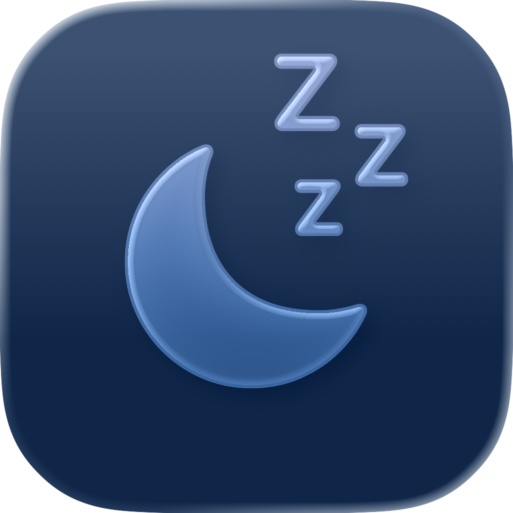
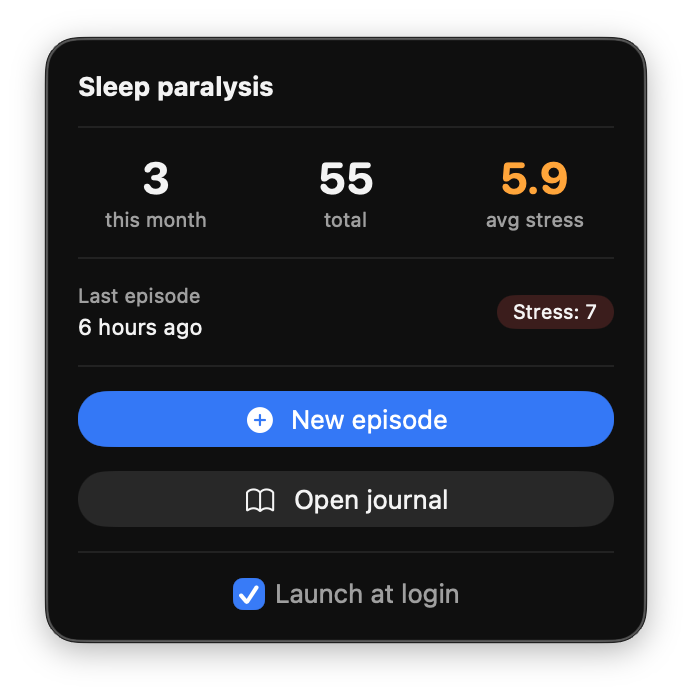

<p align="center">
  
</p>

<h1 align="center">Sleep Paralysis Tracker</h1>

<p align="center">
  A macOS menu bar app to track and analyze sleep paralysis episodes.
</p>

<p align="center">
  
  
  
</p>

## Preview

**App overview:**

https://github.com/user-attachments/assets/74307659-63fc-4a40-aa12-bb5092e46727

**Menu bar:**

<p align="center">
  
</p>

## Features

### Journal

- Log episodes with date, stress level (1-10), hallucination types, sleep position, triggers, and notes
- Edit or delete entries via right-click context menu
- Filter by hallucination, sleep position, or trigger
- Grouped by month, sorted by date

### Statistics

- **Summary cards** — total episodes, average stress, hallucination percentage
- **Episodes per month** — bar chart (last 12 months)
- **Hallucination types** — donut chart with color-coded types
- **Triggers breakdown** — donut chart
- **Stress over time** — line chart with daily averages
- **Calendar heatmap** — monthly view with stress-colored days
- Responsive flow layout that adapts to window size

### Menu Bar

- Always-visible menu bar icon with quick stats
- Episode count this month, total, and average stress
- Last episode with relative date
- Quick add button that opens a dedicated form window
- Open journal button
- Launch at login toggle

### Export

- PDF export with full episode history, formatted for sharing with a doctor

### Localization

- French and English — automatically follows system language

### Storage

- JSON file stored in iCloud Drive (`~/Library/Mobile Documents/com~apple~CloudDocs/SleepParalysisTracker/`)
- Syncs across devices via iCloud

## Data Tracked

| Field          | Options                                                                                                           |
| -------------- | ----------------------------------------------------------------------------------------------------------------- |
| Date & time    | Date picker                                                                                                       |
| Stress level   | 1-10 slider                                                                                                       |
| Sleep position | Back, Side, Stomach, Unknown                                                                                      |
| Hallucination  | Visual, Auditory, Tactile, Presence, Other (multi-select)                                                         |
| Triggers       | Stress, Sleep deprivation, Jet lag, Late screen, Alcohol, Caffeine, Nap, Irregular schedule, Other (multi-select) |
| Notes          | Free text                                                                                                         |

## Requirements

- macOS 15.0+
- Xcode 16+

## Build & Run

```bash
git clone https://github.com/brunet-guillaume/SleepParalysisTracker.git
cd SleepParalysisTracker
open SleepParalysisTracker.xcodeproj
```

Then press **Cmd+R** in Xcode.

The app runs as a menu bar agent — look for the moon icon in the menu bar.

## Tech Stack

- **SwiftUI** — UI framework
- **Swift Charts** — statistics visualizations
- **ServiceManagement** — launch at login
- **Core Text / Core Graphics** — PDF generation

## License

MIT
